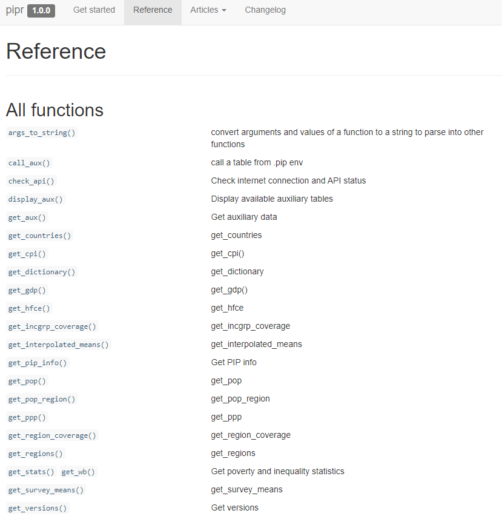

# Outline of the presentation

::: footer
The findings, interpretations, and conclusions expressed in this presentation are entirely those of the author. They do not necessarily represent the views of the World Bank and its affiliated organizations, or those of the Executive Directors of the World Banks or the governments they represent. 

The authors gratefully acknowledge financial support from the UK government through the Data and Evidence for Tackling Extreme Poverty (DEEP) Research Programme.
:::

## Outline

1.   Introduction to the Poverty and Inequality Platform (PIP)

2.   PIP user interface 

3.   Accessing the PIP API with R

4.   Exercises 

5.   Additional resource


# 1. Introduction to the Poverty and Inequality Platform (PIP)

## Poverty data at the World Bank

::: {.incremental}

-   The World Bank mission is to end extreme poverty and boost shared poverty on a livable planet.

-   To that end, the World Bank often helps countries field household surveys to track welfare.

-   Some countries do not receive assistance yet the Bank is granted access to the data through collaborations with the National Statistical Office.

-   For high-income countries, poverty data is sourced from the Luxembourg Income Study or EU-SILC.

:::

   
## The Poverty and Inequality Platform (PIP) {.smaller}

::: {.incremental}

- PIP is the source of poverty and inequality data for the World Bank.

- PIP is the source of data for several targets of the Sustainable Development Goals on ending poverty (SDG1) and reducing inequality (SDG10).

- Collaboration between different parts of the World Bank through the Global Poverty Working Group
   -   Development Data Group
   -   Development Research Group
   -   Poverty and Equity Global Practice

:::


## PIP motivation {.smaller}

::: {.incremental}

- **Scope**: PIP is the World Bank’s data portal for poverty, prosperity, and inequality estimates. 

- **Accessibility**: PIP data is available through Application Programming Interface (API) 
   - User Interface (UI) – for quick data access and visualizations
   - Stata and R wrappers – for advanced users, researchers, students
   - Microdata access (for some surveys) through Microdata Online.

- **Open data, open code, reproducible research**:
   - PIP code is publicly available, and the PIP Methodology Handbook provides details on the poverty, prosperity, and inequality estimates reported in PIP.
   - PIP typically is updated twice a year - Spring/Fall. One can, however, access various vintages of the data.

:::

  
## PIP: Quality, accessibility, and transparency 

::: {.columns}
::: {.column width="40%"}
- All code necessary to create the poverty estimates are publicly available (<https://github.com/PIP-Technical-Team>)
:::
::: {.column width="60%"}
{fig-align="right"}
:::
:::


## PIP: Quality, accessibility, and transparency 

::: {.columns}
::: {.column width="40%"}
- A description of the entire methodology is available in a technical handbook (<https://worldbank.github.io/PIP-Methodology/>)
:::
::: {.column width="60%"}
{fig-align="right"}
:::
:::


## Data release notes and other publications 

::: {.columns}
::: {.column width="30%"}
- Publications are available detailing the updates in each release, methodological assumptions, and other technical improvements (<https://worldbank.github.io/publication/>)
:::
::: {.column width="10%"}

:::
::: {.column width="60%"}
{fig-align="right"}
:::
:::


## Welfare measure reported in PIP


{fig-align="center"}

## Welfare measure reported in PIP


{fig-align="center"}


## Welfare measure reported in PIP


{fig-align="center"}

## Welfare measure reported in PIP


{fig-align="center"}


## Welfare measure reported in PIP


{fig-align="center"}

## Welfare measure reported in PIP


{fig-align="center"}


# 2. Accessing PIP through the user interface


# 3. Accessing PIP in R


```{r}
#| echo: false
#| cache: false
library(pipr)
library(tidyverse)
library(ggthemes)
library(pipr)
```


## The pipr package

::: {.incremental}

- **Installation:**

  ``` r
  # To install the pipr package, you first need to install the devtools package
  install.packages("devtools")
  # The devtools package allows you to install pipr through GitHub
  devtools::install_github("worldbank/pipr")
  # Now load pipr
  library(pipr)
  # I'll use dplyr a lot in these slides, so best to load it as well
  library(dplyr)
  ```

- **More information about the package:**

  <https://worldbank.github.io/pipr/>

:::


## Two main functions {.smaller}

::: {.incremental}

- **`get_stats()`:** [country]{.underline} estimates of poverty and inequality

    - each row identifies a unique combination of *country_code*, *year*, *reporting_level*, and *welfare_type*
    - *reporting_level*: Mostly national, but can be urban or rural
    - *welfare_type*: Income or consumption

- **`get_wb()`:** [regional/global]{.underline} estimates of poverty and inequality

    - each row identifies a unique combination of *region_code* and *year*.

:::


## Country-level estimates

```{r}
#| echo: true
get_stats() 
```


## Variables

```{r}
#| echo: true
colnames(get_stats())
```

<!-- ## Country-level poverty estimates from surveys -->

<!-- ```{r} -->
<!-- #| echo: true -->
<!-- get_stats() |>  -->
<!--   select(country_name, year, welfare_type, reporting_level, headcount, gini) -->
<!-- ``` -->


## Variable information

```{r}
#| echo: true
get_aux("dictionary")
```


## Ghanaian estimates

::: {.incremental}

```{r}
#| echo: true
get_stats(country = "GHA") |> 
  select(country_code, year, poverty_line, headcount,mean,gini)
```

-   The default poverty line is \$3.00 (per capita, per day, in 2021 PPP-adjusted dollars)

-   The mean is expressed in the same currency

:::


## Different poverty line

```{r}
#| echo: true 
get_stats(country = "LUX", povline = 10)  |>    
  select(country_code, year, poverty_line, headcount)
```

## Multiple poverty lines

```{r}
#| echo: true   
povlines <- c(10, 20, 50,100) 
purrr::map_dfr(.x      = povlines,                 
               .f      = get_stats,                 
               country = "LUX",                
               year    = 2022) |>    
  select(country_code, year, poverty_line, headcount) 
```

## Estimates across selected countries

::: {.incremental}

```{r}
#| echo: true
get_stats(country = c("LUX","GHA","VNM"), year=2022) |> 
  select(country_code, year, poverty_line, headcount, mean, gini)
```

- Note that there is no estimate for Ghana (GHA) in 2022 and hence not reported in the output.

:::

## Extrapolation for Ghana from 2016 to most recent year

{fig-align="center"}

## Interpolated and extrapolated values {auto-animate="true"}

```{r}
#| echo: true
get_stats(country = "GHA", fill_gaps = TRUE)  |> 
  filter(year>=2016) |>
  select(country_code, year, poverty_line, headcount)
```


## Poverty by welfare type

::: panel-tabset

### Code

```{r}
#| echo: true
df <- get_stats(country="PHL")       
gr <- ggplot(df,aes(y=100*headcount,x=year,color=welfare_type)) +          
      geom_line() +                     
      labs(                          
      title = "Extreme poverty in the Philippines, 1981-2022",                       
      y = "Poverty rate (%)",                          
      x = ""                   
      )
```

### Plot

```{r}
#| fig-width: 10  
#| fig-height: 5  
gr
```
:::

## Poverty by reporting level

::: panel-tabset
### Code

```{r}
#| echo: true

df <- get_stats(country="CHN") |>
      filter(year>=1990)
  
gr <- ggplot(df,aes(y=100*headcount,x=year,color=reporting_level)) +
      geom_line() + 
      labs(
      title = "Extreme poverty in China, 1990-2022",
      y = "Poverty rate (%)",
      x = "")
```

### Plot

```{r}
#| fig-width: 10
#| fig-height: 5
gr
```
:::

## Within-country comparability

```{r}
#| echo: true
df <- get_stats(country="CHN") |> 
      filter(reporting_level=="national" & year>=1990) |>
      select(year,headcount,comparable_spell,welfare_type)
print(df, n = 21)
```

## Data from LIS

```{r}
#| echo: true 
df <- get_stats() |>
      filter(grepl("LIS", survey_acronym)) |>
      group_by(country_name) |>
      summarize(obs = n()) |>
      ungroup()
print(df, n=29)
```

# 4. Exercises

## Exercise 1 

Explore whether Kuznets' inverse-U hypothesis holds with data in PIP

1.  Plot the relationship between an inequality metric and log mean welfare

2.  Regress an inequality metric on a 2nd order polynomial of log mean welfare

------------------------------------------------------------------------

::: panel-tabset
### Code

```{r}
#| echo: true 
# Kuznets curve? 
df <- get_stats()   
gr <- ggplot(df, aes(x = log(mean),y=gini)) +   
      geom_point() +   
      geom_smooth() +   
      labs(title = "Kuznets curve?",
            y = "Gini coefficient",
            x = "Log welfare")   
summary(lm(gini~log(mean)+I(log(mean)^2),data=df)) 
```

### Plot

```{r}
#| fig-width: 10 
#| fig-height: 6 
gr
```
:::

## Global and regional estimates

```{r}
#| echo: true
get_wb()
```

------------------------------------------------------------------------

## Global poverty, 1990-2022

::: panel-tabset
### Code

```{r}
#| echo: true
df <- get_wb() |>
      filter(year >= 1990, region_code %in% c("WLD","EAP","SSA"))

gr <- ggplot(df, aes(x = year,y = 100*headcount,color=region_code)) +
  geom_line() +
  labs(
    title = "Global poverty, 1990-2025",
    y = "Poverty rate (%)",
    x = ""
  ) 
```

### Plot

```{r}
#| fig-width: 10
#| fig-height: 5
gr
```
:::

## Many more functions

{fig-align="center"}


## Exercise 2 

COVID-19 impact on poverty and inequality

1.  Calculate and plot the change in millions of extreme poor by region from 2019 to 2020

2.  (Difficult) Calculate and plot the changes in Gini observed from 2019 to 2020 for countries with comparable data during these two years

------------------------------------------------------------------------

::: panel-tabset
### Code

```{r}
#| echo: true
# Change in number of poor, 2019-2020
df <- get_wb() |> filter(year==2019 | year==2020) |>
      group_by(region_code) |>
      mutate(changeinpoor = pop_in_poverty-lag(pop_in_poverty)) |>
      filter(!is.na(changeinpoor))

gr <- ggplot(df, aes(y = region_name,x=changeinpoor/10^6)) +
  geom_bar(stat="identity") +
  labs(title = "Change in number of poor, 2019-2020",x = "Milllions",y = "Region") 

```

### Plot

```{r}
#| fig-width: 10
#| fig-height: 6
gr
```
:::

------------------------------------------------------------------------

::: panel-tabset
### Code

```{r}
#| echo: true
# Change in Gini, 2019-2020?=
df <- get_stats() |> 
      filter(year==2019 | year==2020) |>
      filter(reporting_level=="national") |>
      group_by(country_code,welfare_type,comparable_spell) |>
      # Only keeps countries with comparable estimates in 2019 and 2020
      filter(n()==2) |>
      mutate(ginichange = gini-lag(gini)) |>
      filter(year==2020) |>
      ungroup() |>
      # If countries have both income and consumption estimates, use only the latter
      group_by(country_code) |>
      filter(n()==1 | welfare_type=="consumption") |>
      ungroup()

gr <- ggplot(df[df$country_code!="XKX",], aes(x = reorder(country_name, +ginichange),y=ginichange*100,fill=region_name)) +
  geom_bar(stat="identity") +
  labs(title = "Change in Gini index, 2019-2020",y = "Gini points",x = "Country") +
  theme(axis.text.x = element_text(angle = 90, vjust = 0.5, hjust=1))

```

### Plot

```{r}
#| fig-width: 10
#| fig-height: 6
gr
```
:::


## Additional resource {.smaller}

- [Methodological handbook](https://datanalytics.worldbank.org/PIP-Methodology/): Describes all methodological details behind the estimates

- [Poverty & Inequality Briefs](https://www.worldbank.org/en/topic/poverty/publication/poverty-and-equity-briefs): 2-page summary of poverty and inequality in almost every developing country

- [Survey percentiles](https://datacatalog.worldbank.org/search/dataset/0063646): 100 percentiles of each country-year survey distribution

- [Lined-up percentiles distribution](https://datacatalog.worldbank.org/search/dataset/0064304/1000-Binned-Global-Distribution): 1000 points on the global distribution

- [Accessing some of the microdata online](https://pip.worldbank.org/sol/sol-landing)

- [More data and indicators through the user interface](https://pip.worldbank.org/furtherindicators-data)

- [API access](https://pip.worldbank.org/api)


## Thank you for listening.{.smaller}

For further details please contact:

- Diana C. Garcia Rojas <drojas@worldbank.org>
- Zander Prinsloo: <zprinsloo@worldbank.org>
- Rossana Tatulli: <rtatulli@worldbank.org>
- Anubhava Singla: <asingla1@worldbabnk.org>
- Nishant Yonzan: <nyonzan@worldbank.org>