## Outline

1.  Introduction to the Poverty and Inequality Platform (PIP)

2.  PIP user interface

3.  Accessing the PIP API with Stata

4.  Exercises

5.  Additional resources

# 1. Introduction

## Poverty data at the World Bank {.smaller}

::: incremental
-   The World Bank mission is to end extreme poverty and boost shared poverty on a livable planet.

-   To that end, the World Bank often helps countries field household surveys to track welfare.

-   Some countries do not receive assistance yet the Bank is granted access to the data through collaborations with the National Statistical Office.

-   For high-income countries, poverty data is sourced from the Luxembourg Income Study or EU-SILC.
:::

## The Poverty and Inequality Platform (PIP) {.smaller}

::: incremental
-   PIP is the source of poverty and inequality data for the World Bank.

-   PIP is the source of data for several targets of the Sustainable Development Goals on ending poverty (SDG1) and reducing inequality (SDG10).

-   PIP is the joint collaboration between different parts of the World Bank through the Global Poverty Working Group

    -   Development Data Group
    -   Development Research Group
    -   Poverty and Equity Global Department
:::

## PIP motivation {.smaller}

::: incremental
-   **Scope**: PIP is the World Bank's data portal for poverty, prosperity, and inequality estimates.

-   **Accessibility**: PIP data is available through Application Programming Interface (API)

    -   User Interface (UI) -- for quick data access and visualizations
    -   Stata and R wrappers -- for advanced users, researchers, students
    -   Microdata access (for some surveys) through Microdata Online.

-   **Open data, open code, reproducible research**:

    -   PIP code is publicly available, and the PIP Methodology Handbook provides details on the poverty, prosperity, and inequality estimates reported in PIP.
    -   PIP typically is updated twice a year - Spring/Fall. One can, however, access various vintages of the data.
:::

## PIP: Transparency {.smaller}

:::: {.columns}

::: {.column width="40%"}
All code necessary to create the poverty estimates are publicly available (<https://github.com/PIP-Technical-Team>)
:::

::: {.column width="60%"}
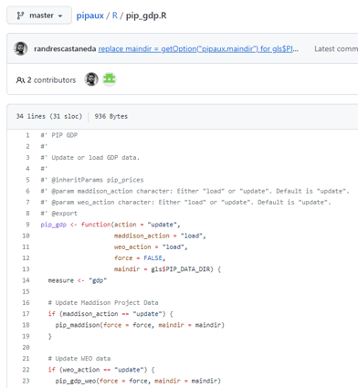{fig-align="right"}
:::

::::

## PIP: Transparency {.smaller}

:::: {.columns}

::: {.column width="40%"}
A description of the entire methodology is available in a technical handbook (<https://worldbank.github.io/PIP-Methodology/>)
:::

::: {.column width="60%"}
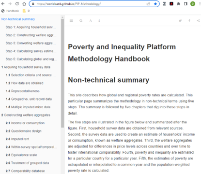{fig-align="right"}
:::

::::


## Data release notes and other publications {.smaller}

:::: {.columns}

::: {.column width="40%"}

Publications are available detailing the updates in each release, methodological assumptions, and other technical improvements (<https://worldbank.github.io/publication/>)

:::

::: {.column width="20%"}

:::

::: {.column width="40%"}
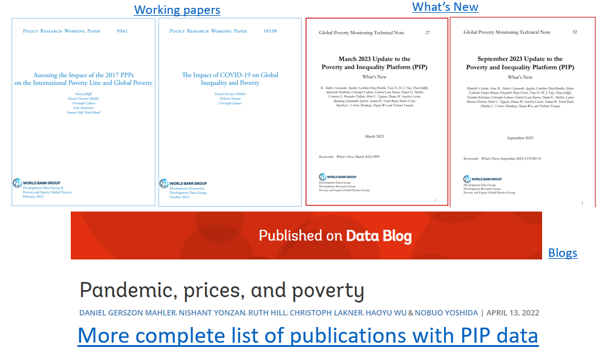{fig-align="right"}
:::

::::

## Welfare measure reported in PIP

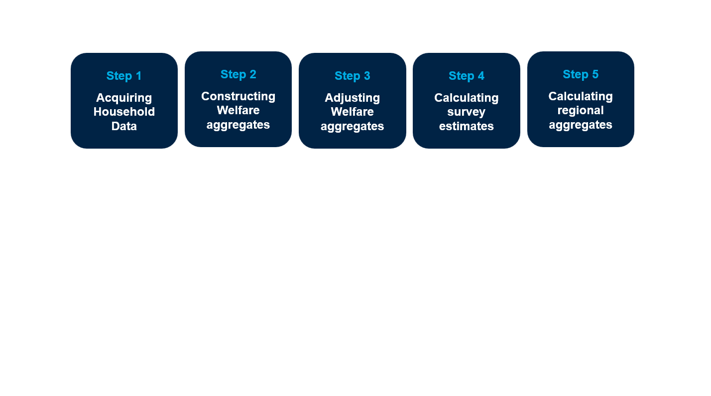{fig-align="center"}


## Welfare measure reported in PIP {.smaller}

::: {.panel-tabset}

## Step 1

### Acquiring Household Data 

- Sources:
  - LIC: Surveys collected by National Statistical Offices
  - HIC: 
    - Europe: EU-SILC
    - Other (and earlier years): Luxembourg Income Study (LIS)
- Data input type: welfare (consumption/income) data at the household or group level

## Step 2

### Constructing Welfare Aggregates 

- Income vs Consumption (welfare_type) -> consumption preferred.
- Zeros dropped.
- Micro or Grouped Data (distribution_type)
- Additional comparability considerations:
  - Questionnaire design changes
  - Equivalence scales (->not used)
  - Spatio/temporal adjustments
  - Imputed rent (-> excluded)
  - Tracked in PIP: comparable_spell and survey_comparability.

## Step 3

### Adjusting Welfare Aggregates 

- Consumer Price Indices (CPIs) & Purchasing Power Parities (PPPs)
- Derivation of the International Poverty Line (poverty_line)
  - \$3.00/day in 2021 PPP -> based on the median of harmonized national poverty lines from poorest countries
- Derivation of higher poverty lines
  - \$4.20 and \$8.30 in 2021 PPP -> based on median values of national poverty lines of lower- and upper-middle income countries, respectively.
- Derivation of societal poverty line (spl)

## Step 4

### Calculating survey estimates  

- Poverty and Inequality metrics are calculated using adjusted welfare aggregates.
- All methodology is available in the PIP Methodological Handbook on the website.
- Source code is available on github through the package wbpip.

## Step 5

### Calculating regional aggregates  

- Extrapolations and/or Interpolations (fill_gaps)
- Nowcasts (nowcast)
- Regional classification
- Population adjustments
- Coverage rules applied


::: 


## Welfare measure reported in PIP

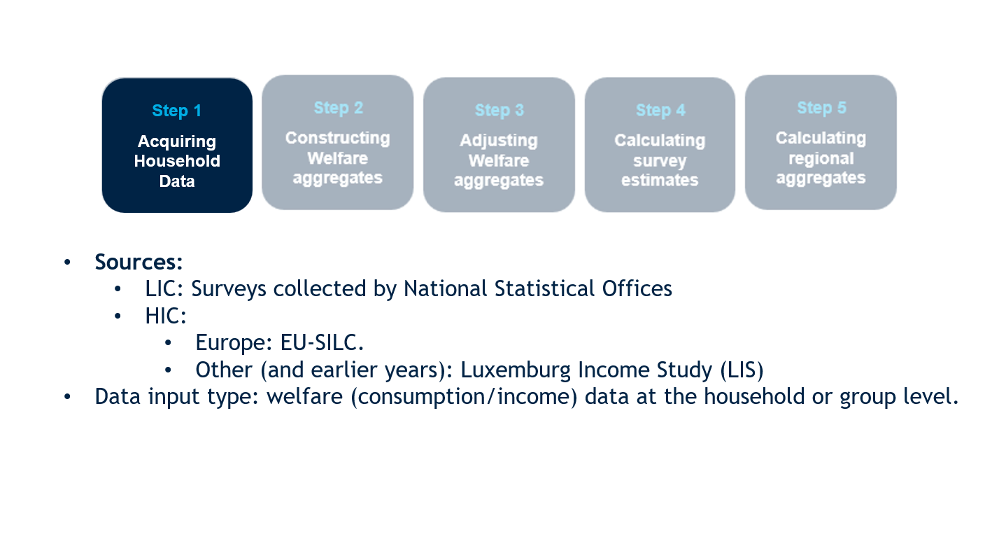{fig-align="center"}

## Welfare measure reported in PIP

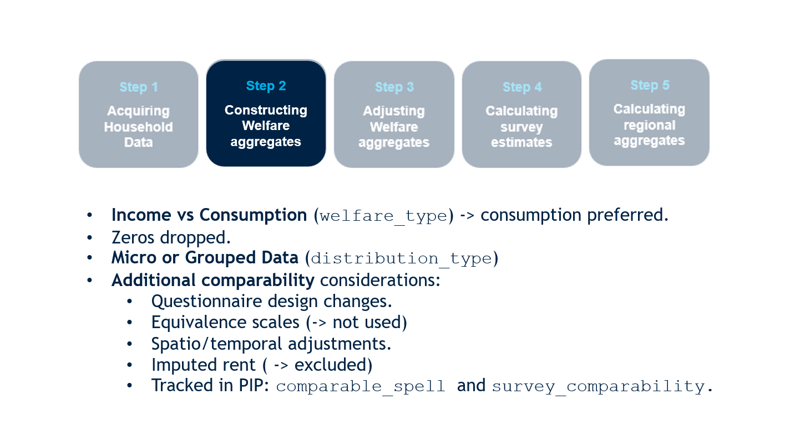{fig-align="center"}

## Welfare measure reported in PIP

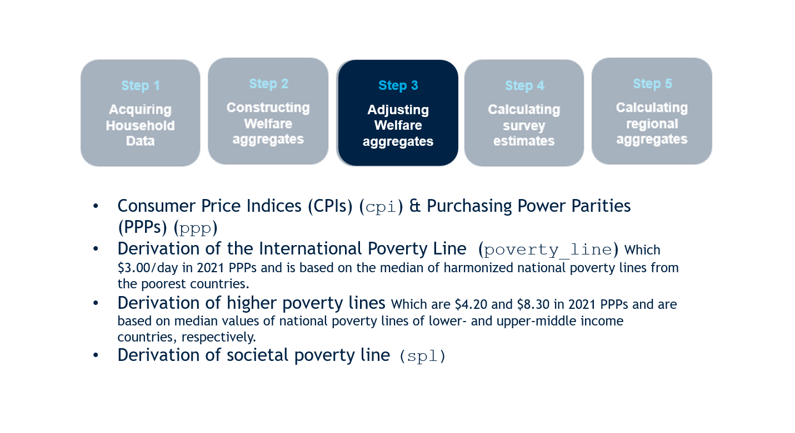{fig-align="center"}

## Welfare measure reported in PIP

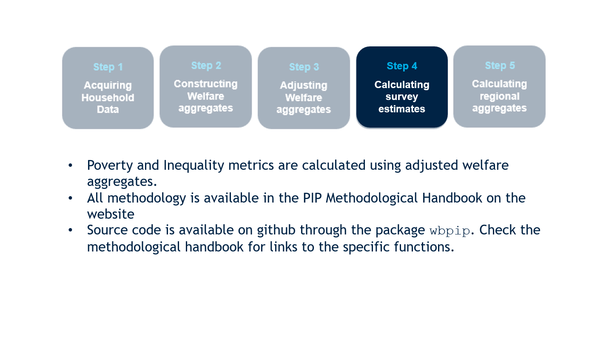{fig-align="center"}

## Welfare measure reported in PIP

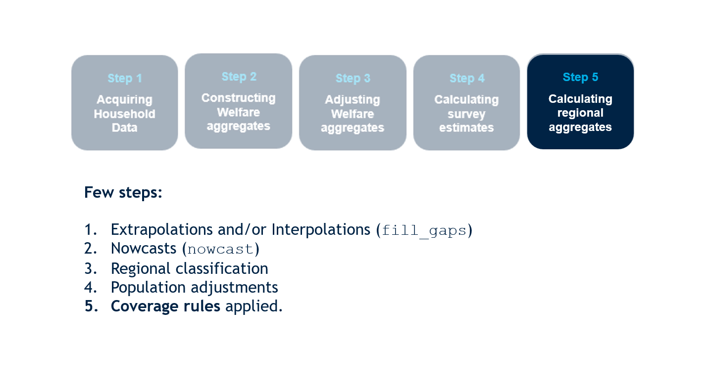{fig-align="center"}

# 2. Accessing PIP through the user interface

# 3. Accessing PIP in Stata

## Installing the Stata pip.ado {.smaller}

::: incremental

We recommend installing the package through GitHub by first running the following, which allows you to install Stata packages from GitHub:

-   `net install github, from("https://haghish.github.io/github/")`

-   You can now install the Stata package by running

-   `github install worldbank/pip`

:::

## Installing the Stata pip.ado {.smaller}


We recommend installing the package through GitHub by first running the following, which allows you to install Stata packages from GitHub:

-   `net install github, from("https://haghish.github.io/github/")`

-   You can now install the Stata package by running

-   `github install worldbank/pip`


**More information about the package:**

<https://github.com/worldbank/pip/>

## Two main functions {.smaller}

::: incremental
-   **`pip cl`:** [country]{.underline} estimates of poverty and inequality

    -   each row identifies a unique combination of *country_code*, *year*, *reporting_level*, and *welfare_type*

    -   *reporting_level*: Mostly national, but can be urban or rural

    -   *welfare_type*: Income or consumption

-   **`pip wb`:** [regional/global]{.underline} estimates of poverty and inequality

    -   each row identifies a unique combination of *region_code* and *year*.
:::

## Country-level estimates {.smaller}

```{r, include=FALSE}
library(Statamarkdown)
```

```{stata, collectcode=TRUE}
#| echo: true
set linesize 200
pip cl, clear
```

## Variables {.smaller}

```{stata}
#| echo: true
describe
```

<!-- ## Country-level poverty estimates from surveys -->

<!-- ```{r} -->

<!-- #| echo: true -->

<!-- get_stats() |>  -->

<!--   select(country_name, year, welfare_type, reporting_level, headcount, gini) -->

<!-- ``` -->

## Ghanaian survey estimates {.smaller}

```{stata}
#| echo: true
pip, country(GHA) n2disp(7) clear
```

## Ghanaian survey estimates {.smaller}

-   The default poverty line is \$3.00 (per capita, per day, in 2021 PPP-adjusted dollars)

-   The mean is expressed in the same currency

## Ghanaian survey estimates with 2017 PPP {.smaller}

```{stata}
#| echo: true
pip, country(GHA) n2disp(7) ppp_year(2017) clear
```


## Different poverty line {.smaller}

```{stata, collectcode=TRUE}
#| echo: false
set linesize 200
```

```{stata}
#| echo: true 
pip, country(LUX) povline(10) clear
```

## Multiple poverty lines {.smaller}

```{stata, collectcode=TRUE}
#| echo: false
set linesize 200
```

```{stata}
#| echo: true   
pip, country(LUX) year(2022) n2disp(4) povline(10 20 50 100) clear
```

## Estimates across selected countries {.smaller}

```{stata, collectcode=TRUE}
#| echo: false
set linesize 200
```

```{stata}
#| echo: true
pip, country(LUX GHA VNM) n2disp(3) year(2022) clear
```

-   Note that there is no survey for Ghana (GHA) in 2022 and hence not reported in the output.


## Extrapolation for Ghana from 2016 to most recent year

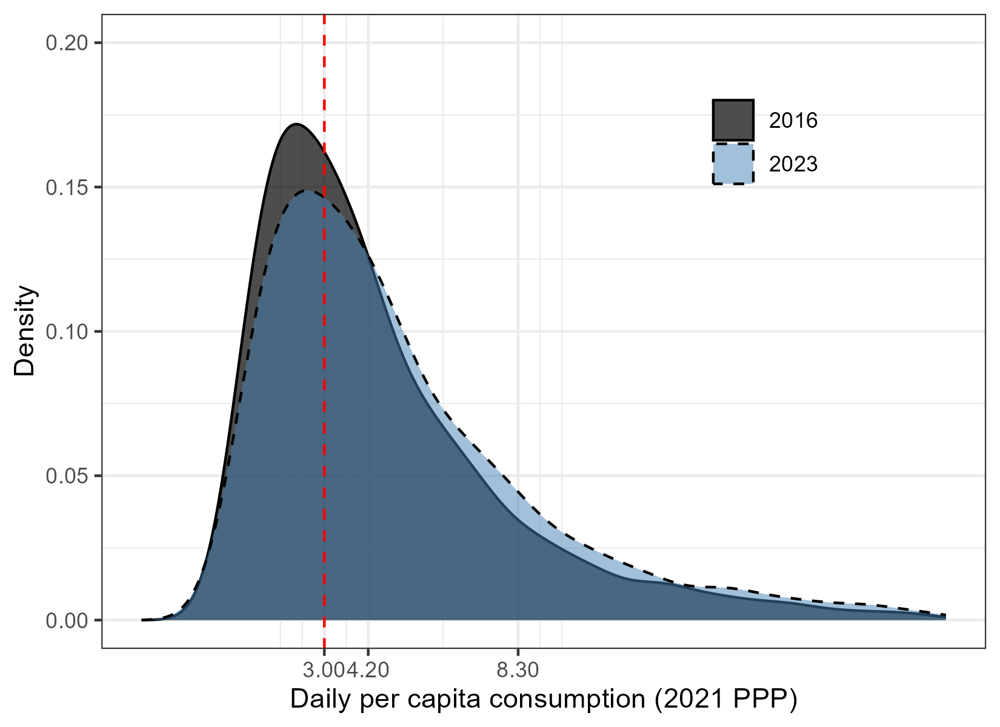{fig-align="center"}

## Interpolated and extrapolated values {.smaller}

```{stata, collectcode=TRUE}
#| echo: false
set linesize 200
```

```{stata}
#| echo: true
pip, country(GHA) year(2016/2025) n2disp(5) fillgaps nowcasts clear
```


## Poverty by the type of welfare aggregate {.smaller}

```{stata, results="hide"}
#| echo: true
pip, country(PHL) clear
graph twoway line headcount year, by(welfare_type) xtitle("") ytitle("Extreme poverty in the Philippines, 1981-2022")
graph export "welfare_plot.svg", replace
```

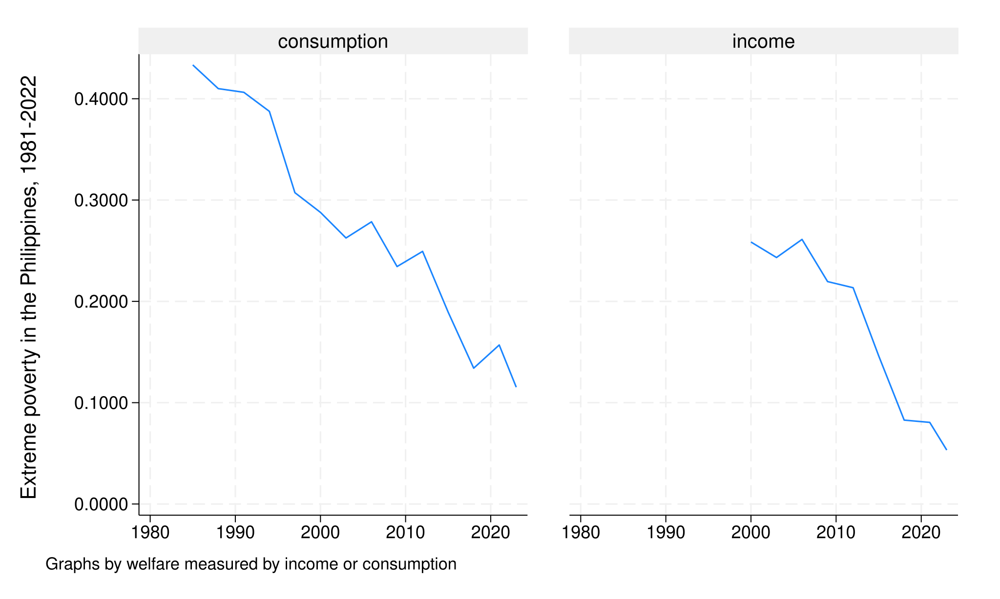

## Poverty by the type of welfare aggregate {.smaller}

```{stata, results="hide"}
#| echo: true
pip, country(PHL) clear
graph twoway scatter headcount year || line headcount year, by(welfare_type comparable_spell, legend(off)) xtitle("") ytitle("Extreme poverty in the Philippines, 1981-2022")
graph export "welfare_plot_2.svg", replace
```

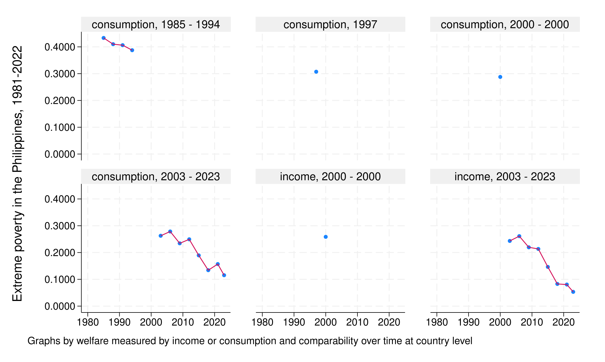

## Poverty by reporting level {.smaller}

```{stata, results="hide", collectcode=TRUE}
#| echo: true
pip, country(CHN) year(1990/2022) clear
graph twoway line headcount year || scatter headcount year, by(reporting_level comparable_spell, legend(off)) xtitle("") ytitle("Extreme poverty in China, 1990-2022")
graph export "rep_level_plot.svg", replace
```
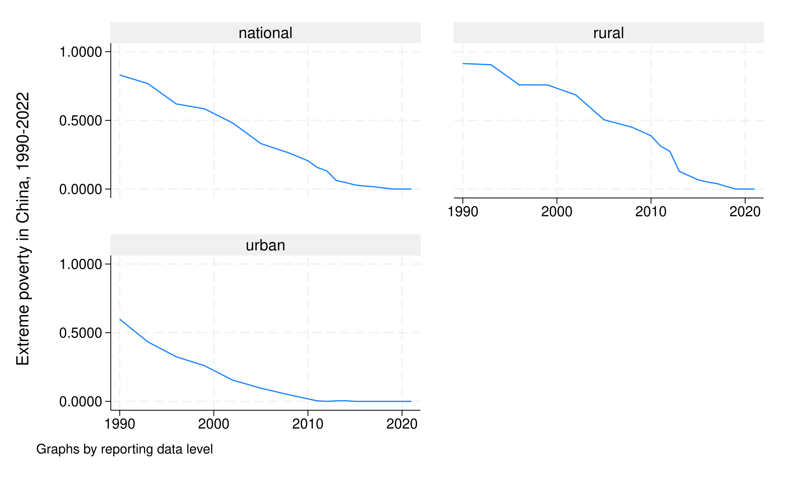

## Within-country comparability {.smaller}

```{stata}
#| echo: true
keep if reporting_level=="national"
list country_name reporting_level year headcount comparable_spell welfare_type
```

## Data from LIS {.smaller}

```{stata, results="hide", collectcode=TRUE}
#| echo: true
pip, clear
keep if strpos(survey_acronym,"LIS")
```

```{stata}
#| echo: true 
tab country_name
```


## Global and regional estimates {.smaller}

```{stata, collectcode=TRUE}
#| echo: true
pip wb, clear
```

```{stata}
#| echo: true
levelsof region_code
```

------------------------------------------------------------------------

## Global poverty, 1990-2022 {.smaller}

::: panel-tabset
### Code

```{stata, results="hide"}
#| echo: true
keep if year>=1990 & inlist(region_code,"WLD","EAP","SSA")
graph twoway line headcount year, by(region_name) ytitle("Poverty rate (%)") ///
ylab(,angle(horizontal))

graph export "pov_90_22.svg", replace
```

### Plot

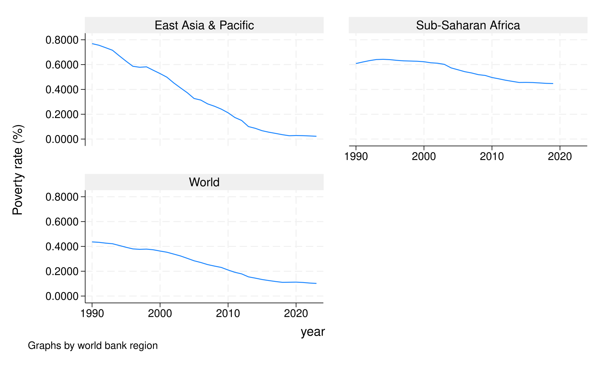

:::

## Many more functions {.smaller}

```{stata}
#| echo: true
pip tables
```


# 4. Exercises

## Exercise 1

Explore whether Kuznets' inverse-U hypothesis holds with data in PIP

1.  Plot the relationship between an inequality metric and log mean welfare

2.  Regress an inequality metric on a 2nd order polynomial of log mean welfare

------------------------------------------------------------------------

## Results {.smaller}

::: panel-tabset

### Code

```{stata, results="hide", collectcode=TRUE}
#| echo: true 

pip, clear

gen logmean = log(mean)
gen logmean2 = log(mean)^2

graph twoway scatter gini logmean || ///
lpolyci gini logmean, ///
title("Kuznets curve?") ///
xtitle("Log welfare") ///
ytitle("Gini coefficient") ///
legend(off)

graph export "ex_1_plot.svg", replace
```

### Regression

```{stata}
#| echo: true 

reg gini logmean logmean2
```

### Plot

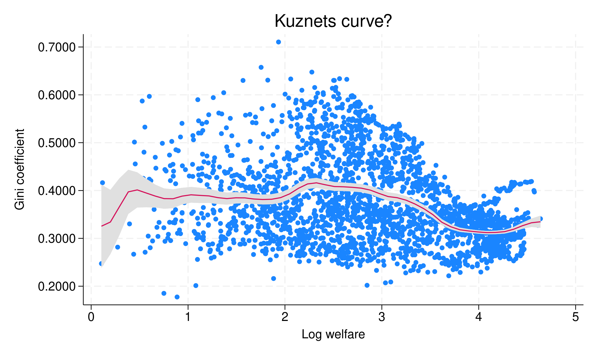

:::

## Exercise 2

COVID-19 impact on poverty and inequality

1.  Calculate and plot the change in millions of extreme poor by region from 2019 to 2020

2.  (Difficult) Calculate and plot the changes in Gini observed from 2019 to 2020 for countries with comparable data during these two years

------------------------------------------------------------------------

## Results (part 1) {.smaller}

::: panel-tabset
### Code

```{stata, results="hide"}
#| echo: true
* Without the nowcast option, data will only be presented for regions with sufficient data coverage

pip wb, nowcasts clear
keep if year==2019 | year==2020
bysort region_code (year): gen changeinpoor = (pop_in_poverty-pop_in_poverty[_n-1])/10^6
keep if year==2020

graph hbar changeinpoor, over(region_code, sort(changeinpoor)) ytitle("Millions") title("Change in number of poor, 2019-2020") yline(0)

graph export "ex_2a_plot.svg", replace
```

### Plot

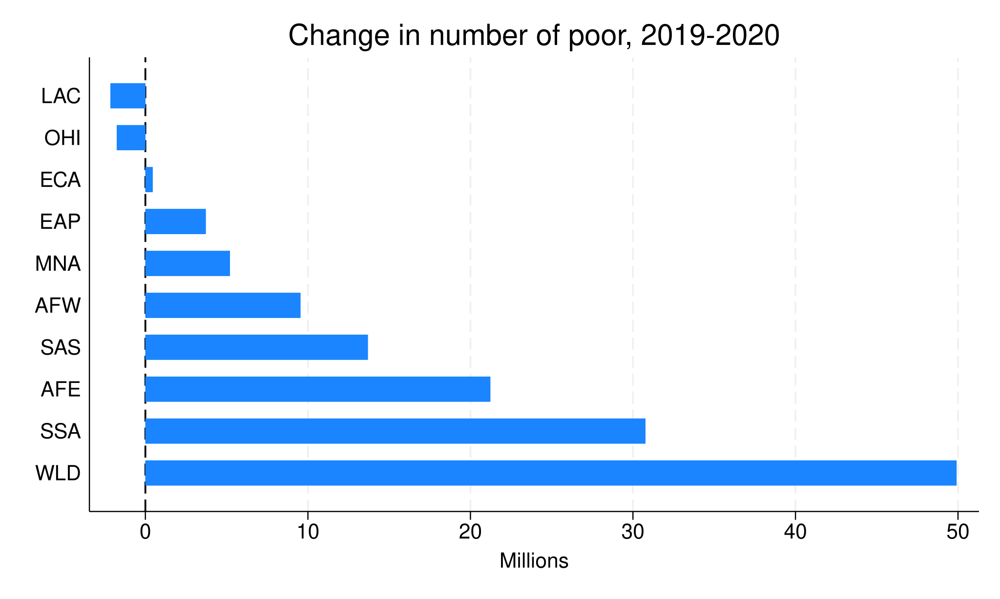
:::

------------------------------------------------------------------------
## Results (part 2) {.smaller}

::: panel-tabset
### Code

```{stata, results="hide", collectcode=TRUE}
#| echo: true
pip, year(2019/2020) coverage(national)

*Only keep countries with comparable estimates in 2019 and 2020:

bysort country_code welfare_type comparable_spell: keep if _N==2
bysort country_code welfare_type comparable_spell (year): gen ginichange = gini-gini[_n-1]
keep if year==2020

*If countries have both income and consumption estimates, use only the latter:

bysort country_code: keep if _N==1 |  welfare_type==1

*Something strange is going on with Kosovo:

drop if country_code=="XKX"

*Draw graph

graph bar ginichange,  over(country_name, sort(ginichange)  gap(0) lab(angle(90) labsize(small)))   ///
title("Change in Gini index, 2019-2020") ytitle("Gini points") 

graph export "ex_2b_plot.svg", replace
```

### Plot

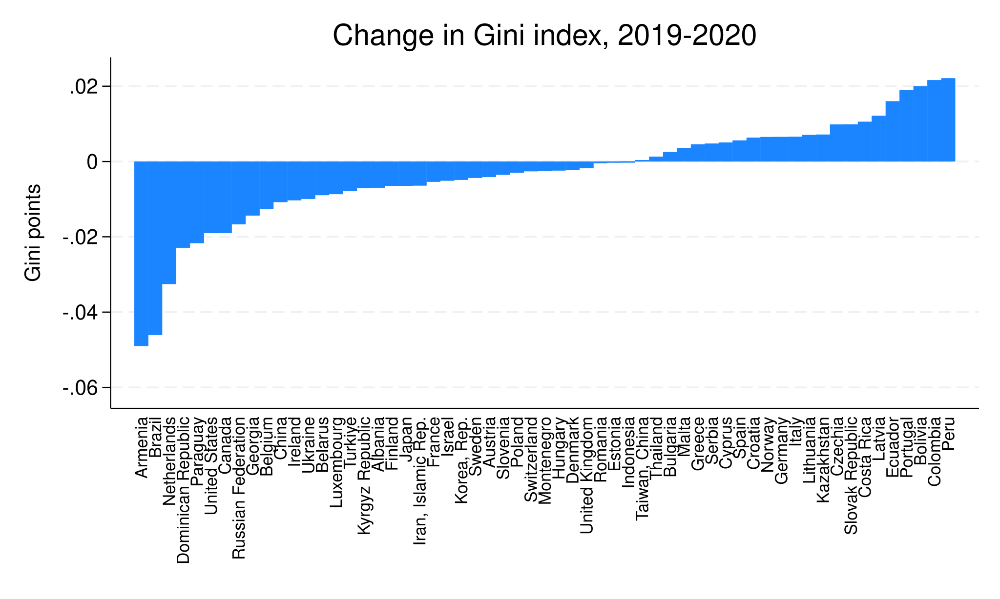
:::

## 5. Additional resource {.smaller}

-   [Methodological handbook](https://datanalytics.worldbank.org/PIP-Methodology/): Describes all methodological details behind the estimates

-   [Poverty & Inequality Briefs](https://www.worldbank.org/en/topic/poverty/publication/poverty-and-equity-briefs): 2-page summary of poverty and inequality in almost every developing country

-   [Survey percentiles](https://datacatalog.worldbank.org/search/dataset/0063646): 100 percentiles of each country-year survey distribution

-   [Lined-up percentiles distribution](https://datacatalog.worldbank.org/search/dataset/0064304/1000-Binned-Global-Distribution): 1000 points on the global distribution

-   [Accessing some of the microdata online](https://pip.worldbank.org/sol/sol-landing)

-   [More data and indicators through the user interface](https://pip.worldbank.org/furtherindicators-data)

-   [API access](https://pip.worldbank.org/api)

## Acknowledgment {.smaller}

The findings, interpretations, and conclusions expressed in this presentation are entirely those of the author. They do not necessarily represent the views of the World Bank and its affiliated organizations, or those of the Executive Directors of the World Banks or the governments they represent. 

The authors gratefully acknowledge financial support from the UK government through the Data and Evidence for Tackling Extreme Poverty (DEEP) Research Programme.

## Thank you for listening. {.smaller}

For further details please contact:

-   Diana C. Garcia Rojas: [dgarciarojas\@worldbank.org](mailto:dgarciarojas@worldbank.org){.email}
-   Zander Prinsloo: [zprinsloo\@worldbank.org](mailto:zprinsloo@worldbank.org){.email}
-   Rossana Tatulli: [rtatulli\@worldbank.org](mailto:rtatulli@worldbank.org){.email}
-   Anubhava Singla: [asingla1\@worldbabnk.org](mailto:asingla1@worldbank.org){.email}
-   Nishant Yonzan: [nyonzan\@worldbank.org](mailto:nyonzan@worldbank.org){.email}
